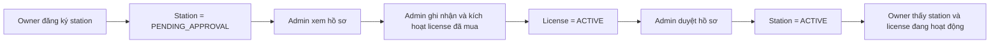
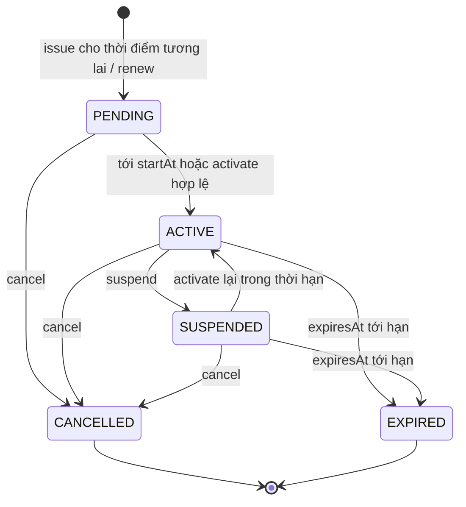

# Frontend Handoff — Station Approval và License Lifecycle

> Cập nhật: 2026-08-16  
> Mục đích: làm nguồn thống nhất để điều chỉnh frontend theo flow nghiệp vụ đã chốt và theo trạng thái backend hiện tại.  
> Phạm vi: đăng ký trạm, admin ghi nhận/kích hoạt license, admin duyệt trạm, admin quản lý lifecycle và owner xem trạng thái. Việc mua/thanh toán license và giấy tờ pháp lý nằm ngoài phạm vi.

## 1. Kết luận nghiệp vụ

Flow chính được chốt là:



Các điểm quan trọng:

- Register station **không tự tạo license**.
- Owner là người **mua subscription theo station**, nhưng purchase/payment được xử lý ngoài nền tảng trong phase hiện tại.
- Owner **không tự activate license** trong ChargeOps.
- Admin dùng use case kỹ thuật `issue` để ghi nhận việc mua đã được xác minh và kích hoạt license cho station đang chờ duyệt.
- Admin không được approve station nếu station chưa có license đang hiệu lực.
- Issue license và approve station là hai action tách biệt.
- Wording frontend nên dùng **“Ghi nhận & kích hoạt license”** cho `issue` và **“Duyệt hồ sơ”** cho `approve`.
- `licenseSubmitted` trong approval detail hiện thực chất có nghĩa là **đang tồn tại active license tại thời điểm kiểm tra**, không chỉ là “đã nộp giấy phép”.

### 1.1 Ý nghĩa License theo SRS v4.7

SRS định nghĩa License là subscription được station owner mua để kích hoạt và duy trì khả năng quản lý charger trên nền tảng. Phí subscription tháng/năm theo từng station là nguồn doanh thu của ChargeOps; tiền thanh toán phiên sạc của driver đi thẳng tới station owner và không phải doanh thu hoa hồng của nền tảng.

Ranh giới “ngoài nền tảng” chỉ áp dụng cho **purchase/payment flow của License**, không áp dụng cho toàn bộ quản lý License:

- Ngoài nền tảng: thu tiền, đối soát hoặc xác minh việc owner đã mua/gia hạn.
- Trong ChargeOps: admin ghi nhận subscription, kích hoạt, theo dõi hiệu lực, nhắc hết hạn, suspend/cancel khi cần và giữ lịch sử theo station.
- License hết hạn làm station mất license gate; theo BR-STA-01 station phải bị ẩn khỏi driver-facing views cho tới khi có license hợp lệ trở lại.
- SRS yêu cầu cảnh báo gia hạn trước 30 ngày.

Vì vậy màn hình License là **subscription operations/revenue control**, không chỉ là bảng trạng thái “giấy phép”. Không được diễn đạt như thể admin tự cấp miễn phí một giấy phép pháp lý cho owner.

### 1.2 Điểm chưa nhất quán trong SRS và quyết định dùng cho implementation

SRS v4.7 có một số điểm không hoàn toàn khớp nhau:

- Actor table nói owner đăng ký station và mua License; admin quản lý License.
- FR12 nói admin ghi nhận và theo dõi active License theo station.
- FR14 đặt bước owner mua License trước bước admin approve station, nhưng một số step của bảng sequence đang để trống.
- BR-ACC-02 viết rằng owner phải có active License trước khi “create or manage stations and chargers”, trong khi License lại cần `stationId`; nếu hiểu sát chữ sẽ tạo vòng lặp không thể register station.
- SRS data model chỉ liệt kê `ACTIVE/EXPIRED/CANCELLED`, còn backend đã mở rộng thêm `PENDING/SUSPENDED` để quản lý lifecycle đầy đủ.

Quyết định implementation để tránh deadlock và vẫn giữ đúng intent của SRS:

1. Owner được tạo **station registration** khi chưa có License.
2. Owner mua subscription ngoài nền tảng cho station đó.
3. Admin ghi nhận/kích hoạt License trên registration.
4. Admin approve station.
5. Chỉ station đã approve và có active License mới mở capability quản lý charger/được xét visibility.

Nếu SRS được chỉnh sau này, BR-ACC-02 nên đổi từ “create or manage stations” thành “manage approved stations and chargers”; quyền tạo registration phải được tách riêng.

## 2. Station state liên quan tới flow này

| Station status | Ý nghĩa ở flow hiện tại | Action chính |
|---|---|---|
| `PENDING_APPROVAL` | Hồ sơ station đã được owner gửi và đang chờ admin xử lý | Issue license, approve nếu đã có active license, hoặc reject |
| `ACTIVE` | Hồ sơ đã được admin duyệt và tại thời điểm duyệt có active license | Owner nhìn thấy station ở trạng thái hoạt động |
| `REJECTED` | Hồ sơ bị từ chối, có reason | Owner sửa/nộp lại ở flow sau |
| `SUSPENDED` | Station bị tạm ngưng | Reactivate theo policy station |
| `WITHDRAWN` | Owner đã rút hồ sơ | Không approve |

Lưu ý: `Station.ACTIVE` hiện thể hiện hồ sơ đã được duyệt. Readiness của charge point/connector và public visibility đầy đủ thuộc task sau, không nên suy diễn thêm trong UI License.

## 3. License state machine đã chốt



| License status | Định nghĩa | Terminal? | UI tone đề xuất |
|---|---|---:|---|
| `PENDING` | License đã tồn tại nhưng chưa có hiệu lực; thông thường `now < startAt` | Không | Neutral/brand |
| `ACTIVE` | Được phép sử dụng khi `startAt <= now < expiresAt` | Không | Good |
| `SUSPENDED` | Tạm vô hiệu hóa thủ công; thời hạn vẫn tiếp tục chạy | Không | Warning |
| `CANCELLED` | Bị chấm dứt thủ công và không thể khôi phục | Có | Bad |
| `EXPIRED` | Đã hết thời hạn và không thể khôi phục | Có | Neutral/bad |

`EXPIRING` **không phải domain state**. Frontend có thể tính `expiringSoon` từ `expiresAt` để hiển thị badge/cảnh báo, nhưng giá trị gửi/nhận với backend vẫn là `ACTIVE`.

### Renew

Renew không phải state transition trên row cũ. Renew tạo một row License mới để giữ lịch sử:

```text
Old license = ACTIVE và còn hạn
    -> renew
New license = PENDING
New.startAt = Old.expiresAt
    -> tới New.startAt
Old = EXPIRED
New = ACTIVE
```

Vì vậy:

- Không update đè `startAt`, `expiresAt`, `plan` hoặc `feeAmount` của row cũ.
- UI phải dùng `license.id` làm row key, không dùng `stationId`, vì một station có nhiều license theo thời gian.
- Nút “Ghi nhận gia hạn” phải ưu tiên cho active license còn tối đa 30 ngày, đúng expiry-warning window của SRS.
- Nếu product cho phép ghi nhận gia hạn sau khi đã hết hạn, action trên `EXPIRED` vẫn phải tạo row mới có hiệu lực từ `now`; row cũ giữ nguyên `EXPIRED`.
- Với `CANCELLED`, wording rõ hơn là “Ghi nhận subscription mới”; không giả lập việc hồi sinh row terminal.
- `PENDING` và `SUSPENDED` không được đưa vào renewal queue một cách mặc định. Chúng cần action đúng theo trạng thái của chính mình.

## 4. Action matrix cho frontend

### 4.1 Approval detail

| Station | Active license hiện tại | Action hiển thị |
|---|---:|---|
| `PENDING_APPROVAL` | Không | Primary: **Ghi nhận & kích hoạt license**; Approve disabled; Reject enabled |
| `PENDING_APPROVAL` | Có | Primary: **Duyệt hồ sơ**; mở/xem license; Reject enabled |
| Khác `PENDING_APPROVAL` | Bất kỳ | Không hiển thị issue/approve/reject của approval queue |

Sau khi issue thành công:

1. Đóng issue modal.
2. Hiển thị toast thành công.
3. Invalidate/refetch approval detail.
4. Invalidate/refetch license history của station.
5. Chỉ enable “Duyệt hồ sơ” sau khi response/refetch xác nhận license `ACTIVE`.

Nếu người dùng bấm approve khi dữ liệu stale và backend trả `APPROVAL_003`, giữ station trong queue, báo lỗi “Trạm cần có License còn hiệu lực trước khi được duyệt” và refetch detail.

### 4.2 Admin License page

| Status | View detail/history | Suspend | Activate lại | Cancel | Ghi nhận gia hạn | Subscription mới |
|---|---:|---:|---:|---:|---:|---:|
| `PENDING` | Có | Không | Chỉ khi đang trong effective period và backend cho phép | Có | Không | Không |
| `ACTIVE` | Có | Có | Không | Có | Có khi sắp hết hạn; tạo row mới `PENDING` | Không |
| `SUSPENDED` | Có | Không | Có, nếu chưa hết hạn | Có | Không theo flow renew đã chốt | Không |
| `CANCELLED` | Có | Không | Không | Không | Không | Có, tạo row mới |
| `EXPIRED` | Có | Không | Không | Không | Có nếu business gọi đây là renewal; luôn tạo row mới | Có, tùy wording product |

Các action transition phải có confirm dialog. Cancel nên cảnh báo rõ đây là terminal action. Suspend phải nói rõ expiry vẫn tiếp tục chạy.

Không dùng một nút text cỡ nhỏ duy nhất trong cột “Hành động”. Mỗi row nên có:

- Row click hoặc nút secondary cỡ chuẩn “Xem chi tiết”.
- Primary action cỡ tối thiểu 36 px khi row đang cần xử lý, ví dụ “Ghi nhận gia hạn”.
- Overflow menu cho action ít dùng: suspend, activate lại, cancel.
- Disable state kèm tooltip/reason thay vì giấu logic trạng thái.

### 4.3 Owner License page

- Read-only; không có issue, activate, suspend hoặc cancel.
- Hiển thị theo station, không giả định một owner chỉ có một license.
- Cho chọn station hoặc group danh sách theo station.
- Hiển thị active/current license trước, sau đó là history.
- Hiển thị đúng cả năm trạng thái backend.
- Với station `PENDING_APPROVAL` nhưng đã có active license, giải thích: license đã được cấp nhưng hồ sơ station vẫn đang chờ admin duyệt.
- Với station `ACTIVE`, hiển thị current license và ngày hết hạn.
- Việc mua/gia hạn được xử lý ngoài nền tảng; frontend chỉ hiển thị trạng thái và hướng dẫn liên hệ/quy trình phù hợp.

## 5. Audit frontend hiện tại

Frontend đã được chỉnh một lượt theo handoff trước: Approval có issue modal, type đã nhận năm trạng thái và Admin License page đã hiển thị thêm status/fee. Tuy nhiên bản trong hai ảnh vẫn còn các mismatch sau.

| Khu vực | Hiện trạng | Vấn đề cần sửa |
|---|---|---|
| Admin Approval | Đã có issue modal và khóa approve khi chưa có active license | Wording “Cấp license” chưa phản ánh owner đã purchase; nên đổi thành “Ghi nhận & kích hoạt license” |
| Issue modal | Có plan, fee, station/owner summary và callout | Đang hard-code 30/365 ngày dù backend tính theo calendar month/year; hard-code mức phí mặc định; chưa có xác nhận đã đối chiếu purchase ngoài nền tảng |
| Admin Licenses | Đã có dashboard, năm status và fee | Action quá nhỏ; chỉ có renew; chưa có detail/history, suspend, activate, cancel và confirm dialog |
| Renewal queue | Đang lấy mọi license không `ACTIVE` | Sai nghiệp vụ: đưa cả `PENDING/SUSPENDED/CANCELLED` vào renew, nhưng bỏ sót `ACTIVE` sắp hết hạn trong 30 ngày |
| Status adapter | Có `normalizeStatus` để tương thích mock cũ | Đang map `expiring -> EXPIRED` và unknown -> `ACTIVE`; cả hai fallback đều nguy hiểm |
| Owner License | Có trang read-only | Chỉ gọi một license toàn cục, chưa hỗ trợ nhiều station/history |
| API service | Đã thêm `issue`; vẫn có `list`, `mine`, `recordRenewal` | Chỉ `issue` có backend thật; URL list/mine/renew vẫn chưa được backend implement |
| Types | Đang union type mới và legacy type, hầu hết field optional | Compatibility layer làm TypeScript không bắt được contract mismatch; nên map legacy mock ở adapter rồi giữ domain type strict |
| Error i18n | Đã thêm `LICENSE_001/002` nhưng còn giữ `STATION_005/006` và key cũ | Xóa alias cũ sau khi mock/test chuyển hết để tránh hai source of truth |
| Runtime config | Mặc định dùng mock | UI có thể trông như đã hoạt động dù chưa gọi backend thật |

### 5.1 Review trực tiếp trang License trong ảnh

Phần tốt:

- Information hierarchy sạch, số liệu status dễ quét.
- Fee, plan, station và owner đã xuất hiện trong table.
- “Mua/gia hạn xử lý ngoài nền tảng” đã được nhắc tới.

Phần cần thay đổi:

- Subtitle “Giám sát hạn giấy phép và ghi nhận gia hạn thủ công” mô tả quá hẹp. Đề xuất: **“Quản lý subscription License theo trạm, theo dõi hiệu lực và ghi nhận mua/gia hạn đã được xác minh ngoài nền tảng.”**
- Callout hiện tại dễ bị hiểu là mọi nghiệp vụ License đều ở ngoài ChargeOps. Đề xuất: **“Owner thanh toán mua/gia hạn ngoài nền tảng. Admin xác minh, ghi nhận và quản lý hiệu lực subscription tại ChargeOps.”**
- “Phân bố gói” hữu ích nhưng không quan trọng bằng queue 30 ngày và tổng phí subscription đã ghi nhận. Vì License là nguồn doanh thu duy nhất, nên ưu tiên operational/revenue cards trước plan mix.
- Không gọi `feeAmount` là doanh thu đã thu nếu chưa có chứng từ/payment status. Wording an toàn là **“Phí License đã ghi nhận”**.
- KPI còn thiếu `CANCELLED`; `expiringSoon` nên là derived counter riêng, không thay cho một domain status.
- Cột action quá nhỏ và gần như trống ở active rows, khiến admin không biết row có detail/history hoặc action khác.

Các source frontend liên quan:

- `chargeops-web/apps/web/src/admin/pages/Approvals.tsx`
- `chargeops-web/apps/web/src/admin/pages/Licenses.tsx`
- `chargeops-web/apps/web/src/owner/pages/License.tsx`
- `chargeops-web/packages/api/src/services.ts`
- `chargeops-web/packages/api/src/rest/services.ts`
- `chargeops-web/packages/api/src/types.ts`
- `chargeops-web/packages/api/src/status.ts`
- `chargeops-web/apps/web/src/i18n/locales/{vi,en}/errors.json`

## 6. Contract backend đang chạy được

### 6.1 Issue license — đã implement

```http
POST /api/v1/stations/{stationId}/licenses
Authorization: role ADMIN
Content-Type: application/json
```

Request hiện tại:

```json
{
  "plan": "MONTHLY"
}
```

`plan` nhận `MONTHLY | YEARLY`. Frontend không gửi `feeAmount`; backend áp giá cố định theo plan và lưu giá đó làm snapshot trên License.

Success: `201 Created`

```json
{
  "data": {
    "id": "license-uuid",
    "stationId": "station-uuid",
    "plan": "MONTHLY",
    "feeAmount": 500000,
    "startAt": "2026-08-16T12:00:00Z",
    "expiresAt": "2026-09-16T12:00:00Z",
    "status": "ACTIVE"
  },
  "meta": {
    "serverTime": 0,
    "apiVersion": "1.0.0",
    "traceId": "..."
  }
}
```

Hành vi hiện tại của backend:

- Backend tự lấy `startAt = now`; frontend không gửi `startAt`.
- Factory tạo `PENDING`, sau đó service activate ngay trong cùng request.
- Kết quả issue hiện tại là `ACTIVE`.
- `expiresAt` được tính theo tháng/năm lịch tại timezone `Asia/Ho_Chi_Minh`.
- Owner của license được lấy từ owner của station; frontend không gửi `ownerId`.
- Nếu đã có license status `ACTIVE`, backend trả `409 LICENSE_002`.

### 6.2 Approval — đã implement

```http
GET  /api/v1/admin/station-approvals
GET  /api/v1/admin/station-approvals/{stationId}
POST /api/v1/admin/station-approvals/{stationId}/approve
POST /api/v1/admin/station-approvals/{stationId}/reject
```

- Approve/reject thành công trả `204 No Content`.
- Approval detail trả `licenseSubmitted: boolean`.
- Backend tính giá trị này bằng query active license trong khoảng `[startAt, expiresAt)`.
- Approve thiếu active license trả `409 APPROVAL_003`.

### 6.3 Owner station summary — đã implement

```http
GET /api/v1/owner/stations/mine?pageNo=1&pageSize=20
```

Mỗi station có thể trả:

```json
{
  "id": "station-uuid",
  "stationCode": "ST000001",
  "name": "Station name",
  "status": "ACTIVE",
  "licenseSummary": {
    "plan": "MONTHLY",
    "expiresAt": "2026-09-16T12:00:00Z"
  }
}
```

API này đủ cho card/summary nhưng chưa thay thế license detail/history.

## 7. API còn thiếu — không được giả định đã implement

Backend hiện chưa có response thật cho list/detail/history và chưa có endpoint transition. `GET /stations/{stationId}/licenses` đang là controller stub trả `null`; `OwnerLicenseController` cũng đang rỗng.

Frontend có thể chuẩn bị interface/UI, nhưng phải mock/feature-flag hoặc chờ backend cho các API sau. Endpoint dưới đây là **target đề xuất**, cần backend xác nhận trước khi coi là contract chính thức:

| Use case | Target đề xuất |
|---|---|
| Admin list toàn bộ license | `GET /api/v1/admin/licenses?pageNo=&pageSize=&status=&stationId=` |
| Admin history theo station | `GET /api/v1/stations/{stationId}/licenses` |
| Admin license detail | `GET /api/v1/stations/{stationId}/licenses/{licenseId}` |
| Suspend | `POST /api/v1/stations/{stationId}/licenses/{licenseId}/suspend` |
| Activate lại | `POST /api/v1/stations/{stationId}/licenses/{licenseId}/activate` |
| Cancel | `POST /api/v1/stations/{stationId}/licenses/{licenseId}/cancel` |
| Renew | `POST /api/v1/stations/{stationId}/licenses/{licenseId}/renew` |
| Owner list license được scope theo token | `GET /api/v1/owner/licenses?stationId=` |

Frontend không được dùng các URL cũ sau như thể chúng đã được backend hỗ trợ:

```text
GET  /licenses/mine
GET  /admin/licenses
POST /admin/licenses/{stationId}/renew
```

Trong ba URL này, chỉ `/admin/licenses` được đề xuất giữ cho global monitoring; hiện tại chưa có implementation backend.

Vì purchase/payment nằm ngoài nền tảng nhưng activation được admin ghi nhận thủ công, list/detail response tối thiểu nên có dữ liệu audit: `licenseId`, station, owner, plan, fee, start/expiry, status, `createdAt` và người ghi nhận. Nếu product muốn chứng minh admin đã đối chiếu giao dịch ngoài nền tảng, có thể bổ sung `externalReference`/`verificationNote`; đây là đề xuất mở rộng, chưa phải contract backend hiện tại. Khi chưa có các field này, UI không nên khẳng định “đã thu tiền”, chỉ nên nói “đã ghi nhận License”.

## 8. TypeScript model mục tiêu

Frontend nên mirror domain enum của backend và tách derived UI state:

```ts
export type LicenseStatus =
  | 'PENDING'
  | 'ACTIVE'
  | 'SUSPENDED'
  | 'CANCELLED'
  | 'EXPIRED';

export type LicensePlan = 'MONTHLY' | 'YEARLY';

export interface LicenseDto {
  id: string;
  stationId: string;
  stationName?: string;
  ownerName?: string;
  plan: LicensePlan;
  feeAmount: number;
  startAt: string;
  expiresAt: string;
  status: LicenseStatus;
  createdAt?: string;
  recordedByName?: string;
}

export interface IssueLicenseRequest {
  plan: LicensePlan;
}
```

Derived UI fields không nên nằm trong API domain type:

```ts
interface LicenseViewModel extends LicenseDto {
  daysLeft: number;
  expiringSoon: boolean;
}
```

`daysLeft` và `expiringSoon` được tính từ một clock thống nhất. Không đổi `ACTIVE` thành `expiring` trong dữ liệu domain.

## 9. UI flow đề xuất

### 9.1 Approval detail — nơi ghi nhận purchase và kích hoạt lần đầu

Khi chọn station trong approval queue:

1. Load approval detail.
2. Nếu `licenseSubmitted == false`:
   - Hiển thị “Chưa có license đang hiệu lực”.
   - Hiển thị nút primary “Ghi nhận & kích hoạt license”.
   - Disable “Duyệt hồ sơ” và giải thích lý do.
3. Mở issue modal với:
   - Station code/name: read-only.
   - Owner: read-only nếu detail có dữ liệu.
   - Plan: required, `MONTHLY | YEARLY`.
   - Fee amount: read-only preview theo plan (`MONTHLY = 500.000 VND`, `YEARLY = 5.000.000 VND`); không gửi trong request. Response backend là nguồn sự thật.
   - Xác nhận admin đã đối chiếu việc mua/thanh toán ngoài nền tảng.
   - Preview `startAt`: “Có hiệu lực ngay sau khi cấp”.
   - Preview expiry: chỉ mang tính UI; response backend là nguồn sự thật.
4. Nút submit ghi rõ “Xác nhận & kích hoạt”, sau đó POST issue endpoint.
5. Sau success, refetch detail và hiện license summary.
6. Admin tiếp tục bấm “Duyệt hồ sơ”.

Không gộp issue và approve thành một request hoặc một nút “Issue & Approve”. Hai hành động cần lỗi, audit và retry độc lập.

Không hiển thị “Hiệu lực 30 ngày/365 ngày”. Backend đang tính theo **một tháng/một năm lịch** trong timezone `Asia/Ho_Chi_Minh`; UI nên ghi “1 tháng” và “1 năm”, còn `expiresAt` trong response là nguồn sự thật.

### 9.2 Admin License page — quản lý sau cấp

Danh sách nên có tối thiểu:

- License ID.
- Station code/name.
- Owner display name.
- Plan.
- Fee amount.
- Start time.
- Expiry time.
- Domain status.
- Derived “sắp hết hạn”.
- Menu action theo matrix ở mục 4.

Nên có drawer/detail để xem history cùng station. Không render một row duy nhất cho mỗi `stationId`.

Thứ tự ưu tiên cho phần trên trang:

1. Active subscriptions và phí License đã ghi nhận.
2. Renewal queue: active license còn tối đa 30 ngày, sau đó tới expired license chưa có replacement.
3. Pending activation và suspended cần xử lý.
4. Plan distribution là insight thứ cấp.

### 9.2.1 Confirmation UX bắt buộc

**Ghi nhận gia hạn** mở modal/drawer form, không gọi mutation trực tiếp từ button:

- Current license ID, station, owner, plan và current expiry: read-only.
- Trong scope hiện tại, đây là thao tác **ghi nhận entitlement đã xử lý ngoài nền tảng**, không phải checkout.
- Không gửi `feeAmount`, discount hoặc tạo `Transaction` từ nút gia hạn. Backend renew chưa được implement nên frontend real API phải feature-gate/disable action này.
- Nếu giữ mockup giá và discount (ví dụ 16.7%) để minh họa hướng phát triển, phải gắn nhãn rõ **Future — in-platform License checkout** và không để người dùng hiểu là chức năng đang hoạt động.
- Effective start preview:
  - Active còn hạn: `old.expiresAt`.
  - Đã expired và backend cho phép late renewal: `now`.
- Dòng giải thích: “Thao tác tạo một License row mới; không sửa License hiện tại.”
- Xác nhận đã đối chiếu việc gia hạn ngoài nền tảng.
- CTA: “Xác nhận ghi nhận gia hạn”.

Nếu tương lai ChargeOps thu tiền License trực tiếp, pricing/discount phải thuộc module riêng như `LicenseOrder` và `LicensePayment`. Ledger `Transaction` hiện tại tiếp tục chỉ phục vụ Driver booking payment/refund; không thêm `license_id` trở lại bảng này.

**Suspend** cần confirm:

- Nói rõ đây là tạm thời.
- Expiry vẫn tiếp tục chạy.
- Nêu ảnh hưởng dự kiến tới charger-management/driver visibility theo policy khi backend T16 hoàn tất.
- CTA: “Xác nhận tạm ngưng”.

**Activate lại** cần confirm và hiển thị remaining period; không cho phép nếu đã ngoài `[startAt, expiresAt)`.

**Cancel** cần danger confirmation:

- Đây là terminal action và không thể khôi phục row hiện tại.
- Muốn sử dụng lại phải ghi nhận subscription mới.
- CTA danger: “Xác nhận hủy License”.

Đối với mutation có tác động, button phải có pending state, chống double-submit, error toast theo stable error code và refetch detail/list sau success.

### 9.3 Owner License page

Owner page nên có:

- Station selector hoặc group theo station.
- Current license card.
- Status explanation.
- Start/expiry/fee/plan.
- History read-only.
- Empty state cho station chưa có license.
- Banner riêng cho trường hợp license active nhưng station vẫn `PENDING_APPROVAL`.

## 10. Error handling và i18n

Frontend localize theo stable `error.code`, dùng backend `message` làm fallback.

| HTTP | Code | Ý nghĩa/UI behavior |
|---:|---|---|
| 404 | `LICENSE_001` | License không tồn tại; đóng/stale detail nếu cần và refetch |
| 409 | `LICENSE_002` | Station đã có active license; không retry issue, refetch license/detail |
| 409 | `LICENSE_003` | License bị admin khác cập nhật trước; refetch detail/list rồi yêu cầu người dùng thử lại |
| 409 | `LICENSE_004` | State transition không hợp lệ; refetch và dựng lại action theo status mới |
| 409 | `LICENSE_005` | Không thể activate ngoài `[startAt, expiresAt)`; không retry cùng payload |
| 409 | `LICENSE_006` | Chưa đến `expiresAt`, không được mark expired; hiển thị thời điểm hết hạn |
| 409 | `APPROVAL_003` | Chưa có active license; giữ approval mở, dẫn admin sang issue |
| 400 | `SYS_003` | Request/validation không hợp lệ; map `error.details` vào field của issue form |

Các i18n entry cũ cần thay:

```text
STATION_005 -> LICENSE_002
STATION_006 -> LICENSE_001
error.station.activeLicenseAlreadyExists -> error.license.activeLicenseAlreadyExists
error.station.licenseNotFound -> error.license.notFound
```

Validation message key hiện dùng:

```text
validation.license.plan.required
```

## 11. Cache invalidation tối thiểu

Sau issue/suspend/activate/cancel/renew, invalidate các query có liên quan:

```text
['licenses']
['licenses', stationId]
['approvals']
['approvals', 'detail', stationId]
['stations', 'mine']
['dashboard', 'admin']
['dashboard', 'owner']
```

Chỉ invalidate các key đang được codebase sử dụng; chuẩn hóa query-key factory là một cleanup nên làm khi triển khai.

## 12. Acceptance criteria cho frontend handoff

- Approval detail hiển thị đúng `loading / không có active license / có active license`; không dùng giá trị giả trong lúc loading.
- Admin ghi nhận và kích hoạt được license đã mua từ approval detail bằng API issue hiện có.
- Approve disabled khi detail xác nhận chưa có active license.
- Issue thành công làm approval detail chuyển sang active-license state mà không reload trang.
- Frontend dùng năm domain status viết hoa và không gửi `expiring` về backend.
- Active license còn tối đa 30 ngày xuất hiện trong renewal queue dưới dạng `expiringSoon`, nhưng status vẫn là `ACTIVE`.
- `PENDING`, `SUSPENDED` và `CANCELLED` không bị đưa nhầm vào renewal queue.
- License row dùng `license.id`, hỗ trợ nhiều row cho một station.
- Renew/suspend/activate/cancel không chạy trực tiếp từ text link; mỗi action có form/confirmation phù hợp và pending state.
- Issue/renew wording thể hiện owner purchase ngoài nền tảng và admin chỉ xác minh, ghi nhận, quản lý hiệu lực.
- Admin License page không gọi list/renew endpoint chưa implement khi chạy real API nếu chưa có feature flag/fallback rõ ràng.
- Owner License page không giả định một owner chỉ có một license.
- Error i18n dùng `LICENSE_001`, `LICENSE_002`, `APPROVAL_003` và các message key mới.
- Chạy với `VITE_USE_MOCKS=false` để xác minh integration thật; mặc định hiện tại vẫn là mock nếu biến môi trường không được đặt thành `false`.
- E2E tối thiểu pass:

```text
Owner register station
  -> station PENDING_APPROVAL
Admin mở approval detail
  -> chưa có license, approve disabled
Admin xác minh purchase và issue/activate license
  -> license ACTIVE
Admin approve station
  -> station ACTIVE
Owner refresh stations/license
  -> thấy station ACTIVE và license ACTIVE
```

## 13. Source of truth đã đối chiếu

Backend:

- `src/main/java/com/thang/chargeops/station/controller/AdminLicenseController.java`
- `src/main/java/com/thang/chargeops/station/service/impl/LicenseServiceImpl.java`
- `src/main/java/com/thang/chargeops/station/entity/License.java`
- `src/main/java/com/thang/chargeops/station/policy/StationApprovalPolicyImpl.java`
- `src/main/java/com/thang/chargeops/station/controller/AdminStationApprovalController.java`
- `src/main/java/com/thang/chargeops/station/controller/OwnerLicenseController.java`
- `src/main/java/com/thang/chargeops/exception/errorcode/LicenseErrorCode.java`

SRS:

- `chargeops-frontend/documents/ChargeOps_SRS_v4_7.docx`: glossary License; actor responsibilities; FR06 Platform Revenue; FR12 License Management; FR14 License-Based Registration; BR-STA-01; BR-ACC-02; out-of-scope License payment processing.

Frontend:

- `chargeops-web/apps/web/src/admin/pages/Approvals.tsx`
- `chargeops-web/apps/web/src/admin/pages/Licenses.tsx`
- `chargeops-web/apps/web/src/owner/pages/License.tsx`
- `chargeops-web/packages/api/src/services.ts`
- `chargeops-web/packages/api/src/rest/services.ts`
- `chargeops-web/packages/api/src/types.ts`
- `chargeops-web/packages/api/src/status.ts`
- `chargeops-web/packages/api/src/config.ts`
